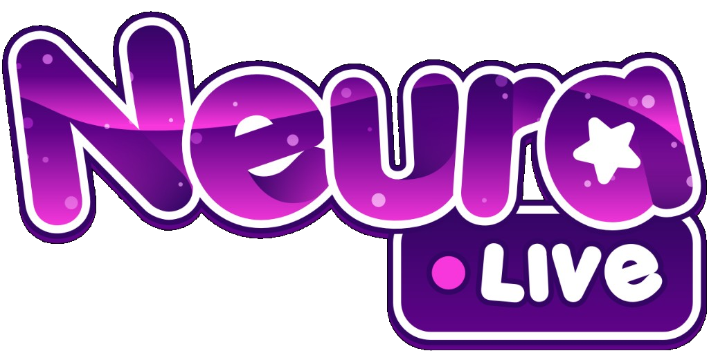

  

  <strong>El laboratorio de NeuraLive.</strong> 
  Software, herramientas, MCP y sistemas de IA — hechos por el equipo de desarrollo de NeuraLive.

  
  
  
  
  
  

---

## Qué es esto

**NeuraLive Labs** es la rama de desarrollo de [NeuraLive](https://neuralive.online/es/): la agencia de creadores y talento. Aquí el trabajo del equipo deja de ser idea y se vuelve software real: herramientas, servidores MCP y sistemas de inteligencia artificial.

Este perfil reúne los proyectos públicos del laboratorio.

## En el aire

| | |
| --- | --- |
| **Web** | [neuralive.online](https://neuralive.online/es/) |
| **YouTube** | [@NeuraLiveTV](https://www.youtube.com/@NeuraLiveTV) |
| **Twitch** | [neuralive_](https://www.twitch.tv/neuralive_) |
| **Instagram** | [@neuralive_](https://www.instagram.com/neuralive_) |
| **TikTok** | [@neuralive](https://www.tiktok.com/@neuralive) |
| **X** | [@NeuraLive_](https://x.com/NeuraLive_) |

## Qué construimos

- **Software** para la operación de NeuraLive y de quienes crean con nosotros.
- **Herramientas** que acortan el camino entre una idea y algo que ya se puede usar.
- **MCP** para conectar asistentes con los sistemas del laboratorio.
- **Sistemas de IA** pensados para producción, no para una demo.

## Autoría

  

  MauDevVR · contacto solo por GitHub noreply <code>173258006+MauDevVR@users.noreply.github.com</code>

